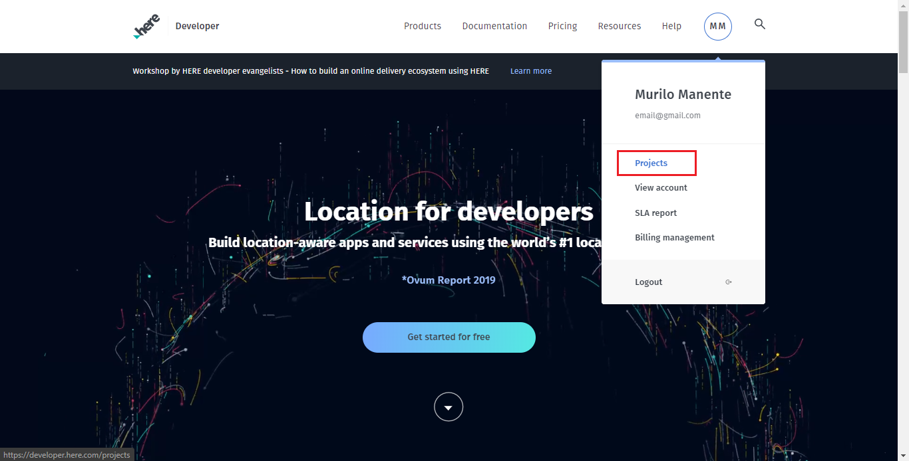
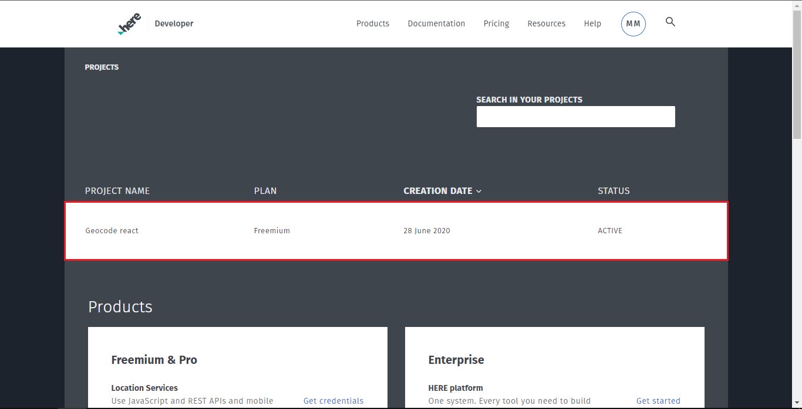
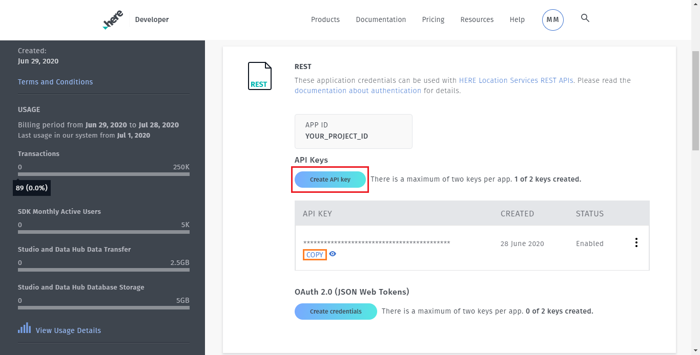

# Map :world_map:

A simple map made to search places around the world.

## Features

* __ReactJS__ — A JavaScript library for building user interfaces
* __Leaflet__ — A JavaScript library for interactive maps
* __React-Leaflet__ — React components for Leaflet maps
* __Axios__ — Promise based HTTP client for the browser
* __Geocoding and Search API__ — API made for convert address to coordinates by HERE Technologies

## How to use the app?

When you open the app for the first time, click at allow browser to access your geolocation to map load your current position. To search a place, click on text box, type the address and press magnifying glass icon :mag: or Enter key (Examples: 226 King St, Redwood City, CA or R. Pitágoras, 353 - Cidade Universitária, Campinas-SP). After, a marker will show the location for you.

## How to use the API?

Before start, be sure you have an account on [HERE website](https://developer.here.com/). You can choose the "Freemium" plan to build your app with limited resources for only tests.

On the homepage, hover the mouse cursor over the profile item and click in "Projects" button:

After, click in your project:

And now, create an API key to use in your project and click in copy:

To use the API, you need send the request using this link (without curly brackets): https://geocode.search.hereapi.com/v1/
geocode
?q={ADDRESS}
&apiKey={YOUR_API_KEY}

For more details, see the [documentation](https://developer.here.com/documentation).

### Observations

App icon made by [Vectors Market](https://www.flaticon.com/authors/vectors-market "Vectors Market") from [www.flaticon.com](https://www.flaticon.com/ "Flaticon")
